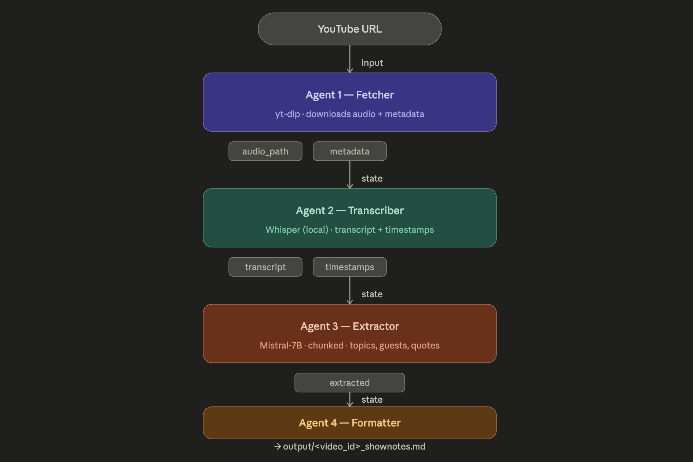

# 🎥 YT-Podcast-Notes-Generator
This repository holds code for a Multi Agent Notes Generator for YouTube Podcasts
<div align="center">
  
  <br><br>
</div>

# 👀 Overview
This is a Multi-Agent AI System that creates notes for Podcasts that are hosted on YouTube, provided with the URL.
Notes are saved as Markdown Files in the generated Output directory.

Notes contain the following contents:
- 📈 Episode Metadata (Title, Uploader, Duration, etc)
- 📝 Episode Summary
- 🗂️ Key Topics
- 👤 Guests
- 💬 Notable Quotes
- ⏱️ Chapter Markers

<div align="center">
  
  <br><br>
</div>

The system is comprised of the following agents:
- **Fetcher**: Takes the YouTube URL provided by the user and uses yt-dlp to download the audio as an MP3 and extract metadata like the title, uploader, duration, and upload date. Everything gets stored in state for the downstream agents to use.

- **Transcriber**: Takes the audio file path from the Fetcher and runs it through OpenAI Whisper locally on your machine. Produces two things: the full transcript as a single block of text, and a list of timestamped segments (start time, end time, text) which are later used for chapter markers.

- **Extractor**: Takes the full transcript and splits it into overlapping 4,000-character chunks so nothing is missed. Runs each chunk through Llama on Hugging Face and extracts key topics, guest names, and notable quotes. Results from all chunks are merged and deduplicated before being stored in state.

- **Formatter**: Takes all the data collected by the previous three agents — metadata, transcript, extracted topics/guests/quotes, and timestamps — and produces the finished show notes. Makes one LLM call to generate a polished 2-3 sentence episode summary from the first 3,000 characters of the transcript, then assembles everything into a structured Markdown file and writes it to disk.

This project has been built with the following: 
- [**LangGraph**](https://www.langchain.com/langgraph)
- [**yt-dlp**](https://github.com/yt-dlp/yt-dlp)
- [**OpenAI Whisper**](https://openai.com/index/whisper/)
- [**Hugging Face**](https://huggingface.co/)


# 🛠️ Setup
In order to run this application the following are requirements:
- [**Python**](https://www.python.org/)
- [**Hugging Face API Token**](https://huggingface.co/)
- [**ffmpeg Platform**](https://www.ffmpeg.org/)

After downloading and installing the above, please clone this repository.

Then create a `.env` file and add the following content:
```
HUGGING_FACE_API_KEY=YOUR_HUGGING_FACE_API_TOKEN
```

Afterwards, with your prefered Python Runtime Environment run `main.py` to run the application.

# 💻 Sample Usage 
After running the application, you will be met with the following prompt:
```
🎥Please Enter the URL of the YouTube Video:
```

After, providing the application with the URL to [this](https://www.youtube.com/watch?v=om2lIWXLLN4&t=37s) video, the following Markdown file gets generated:
```
# Building Anthropic | A conversation with our co-founders

> **Uploader:** Anthropic  
> **Published:** December 20, 2024  
> **Duration:** 51m 49s

---

## 📝 Episode Summary

In this episode of Building Anthropic, our co-founders share the story behind the company's formation and the journey that led them to develop AI responsibly. From their early days at Google Brain and Open AI, to the discovery of scaling laws and the excitement of GPC2, they recount their experiences and insights that shaped their vision for Anthropic. Through a candid conversation, they delve into the motivations, challenges, and lessons learned that have guided their approach to AI safety and scaling.

---

## 🗂️ Key Topics
- AI development
- Google Brain
- Open AI
- scaling laws
- safety
- AI safety
- GPC2
- Anthropic
- OpenAI
- ML
- AI data targets
- AI scaling hypothesis
- AI winter
- conservatism in academia
- herding behavior
- public sentiment
- ML research
- impact of AI
- consensus on AI
- Nvidia
- AI research
- GPUs
- career decisions
- AI potential
- non-profit
- company functionality
- trust and safety
- AI safety research
- responsible scaling policy
- Anthropic RSP development
- Safety in AI
- Organizational structure
- RSP
- incentives
- iteration
- gray areas
- Communication
- Model evaluation
- Policy
- safety seat belt
- healthy feedback flow
- operationalizing
- founding a company
- AI
- capital
- environment
- pattern matching
- science
- public
- impact
- institution
- trust
- mission
- scaling
- company culture
- politics
- unity
- company mission
- theory of change
- pragmatism
- safety research
- constraints
- trade-offs
- trust and credibility
- Technical safety
- Business
- Competitiveness
- Neural network beauty
- Innovation
- Customer needs
- Market impact
- AI systems
- neural networks
- future of AI
- government regulation
- interpretability
- AI in biology
- AI and democracy

## 👤 Guests
- **Jared**
- **Sam**
- **Tom**
- **Chris**
- **Dario**
- **Farron**
- **Darryl**
- **Zillard**
- **Teller**
- **Aryan**
- **Harris**
- **Romondo**
- **Michael Jordan**
- **Greg**
- **Paul Cristiano**
- **Paul**
- **no guest name mentioned**
- **Danielle**
- **Jack**
- **Chris Ola**

---

## 💬 Notable Quotes
- "I was trying to make the point that like, they're very general and like they don't apply to one thing."
- "I think we're also excited about safety, because there was sort of this idea that AI would become very powerful, but potentially not understand human values or not even be able to communicate with us."
- "I think we're the people that were making things work."
- "I think it was like Chris and I decided to write down. What are some open problems in terms of AI safety?"
- "I mean, now there's been like, you know, six, seven years of working that vein, but there was almost a strange idea at the time."

---

## ⏱️ Chapter Markers
- `00:00` — Why are we working on AI in the first place?...
- `05:01` — Can we kind of ground it in the ML that was going on at the time?...
- `10:02` — And when you've seen the consensus can change overnight....
- `15:03` — Should I try to do this thing?...
- `20:04` — Yeah....
- `25:04` — when we were talking about the early versions of it,...
- `30:05` — and I see why I would be worried about these things....
- `35:05` — Unity is so important....
- `40:05` — is that if you have at the level of a single company,...
- `45:08` — walking into a bookstore and buying the textbook...
- `50:11` — and thropic because they're sort of scientifically...

---

*Show notes generated automatically by 🎥YT-Podcast-Notes-Generator (https://github.com/shahLLL/YT-Podcast-Notes-Generator#yt-podcast-notes-generator)*

```

# 🍴 Forking & Contribution
Forking, Contributions and feedback are more than welcomed. 

When forking and/or contributing to this project , please do pay attention to: [LICENSE](./LICENSE)


☕☕☕**CHEERS AND THANK YOU**☕☕☕